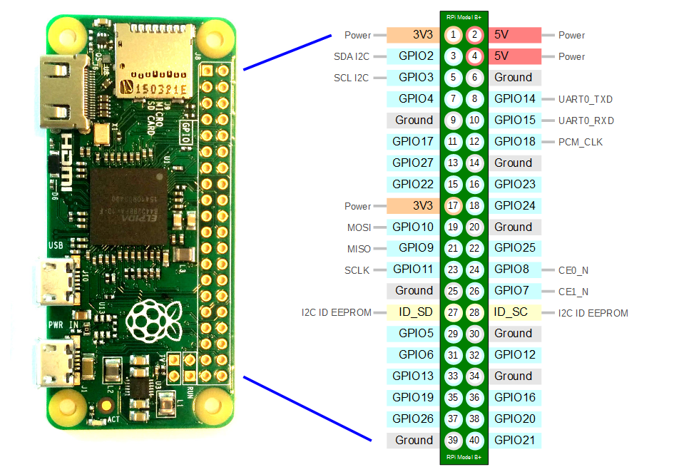

# ECEA-5307-Hardware_Integration

## Setup

Enable the LCD

` sudo raspi-config`

Navigate to 'Interface Options' then 'I2C'
Select 'Yes' to enable then reboot

Documentation: https://rplcd.readthedocs.io/en/stable/getting_started.html


## Python Pip Setup
```

python -m pip install adafruit-circuitpython-matrixkeypad
python -m pip install RPi.GPIO
python -m pip install RPLCD

```

## GPIO Usage



| Pin in Use | Type | Description |
|  ---------------- |  ---------------- |  ---------------- |
| 26 | GPIO | Keypad Column 1 |
| 20 | GPIO | Keypad Column 2 |
| 21 | GPIO | Keypad Column 3 |
|  5 | GPIO | Keypad Row 1 |
|  6 | GPIO | Keypad Row 2 |
| 13 | GPIO | Keypad Row 3 |
| 19 | GPIO | Keypad Row 4 |
|  6 | GND | LCD Ground |
|  4 | PWR | LCD Power |
|  2 | SDA | LCD SDA I2C |
|  3 | SCL | LCD SCL I2C |

